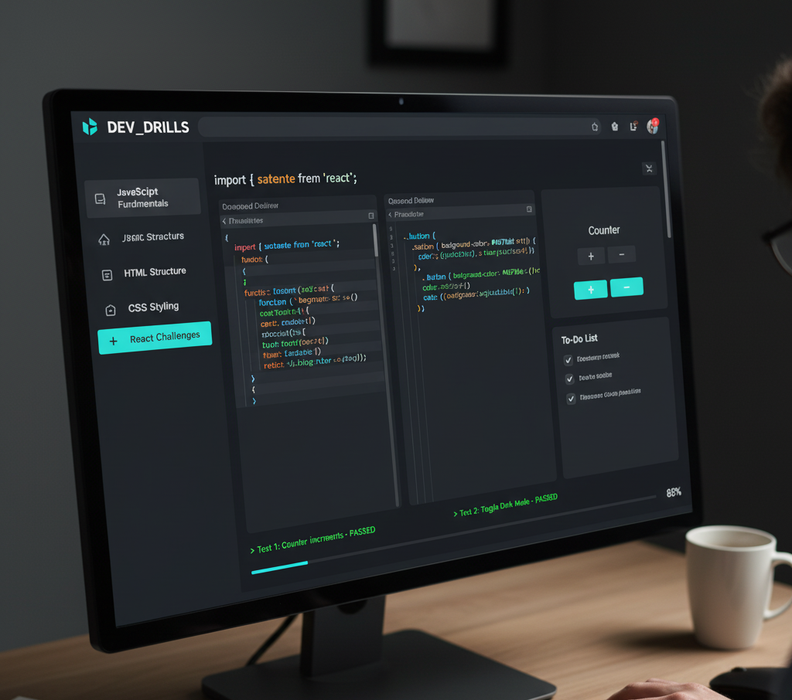

# 🚀 Ejercicios Prácticos para Entrenamiento Técnico

Este repositorio contiene una colección de **ejercicios prácticos** para mejorar tus habilidades en **JavaScript**, **CSS** y **HTML**, especialmente pensados para **entrevistas técnicas** y **práctica diaria**.

  

---

## 📂 Secciones de Ejercicios

1. **JavaScript - Lógica y Algoritmos**
2. **JavaScript - Manipulación del DOM**
3. **CSS - Estilización**
4. **HTML - Maquetación**

---

## 👉**También encontrarás ejercicios para resolver de REACT.JS dentro de la carpeta `EjerciciosReact`.**

## 👉**Dentro de la carpeta `Solutions` podrás ver algunas posibles soluciones, y donde puedes realizar PR con otra carpeta de soluciones (ejemplo: "Soluciones-Mate", "Soluciones-Care"...). Además, puedes agregar más ejemplos de ejercicios para desarrollar y practicar.**

---

## 🟨 1. JavaScript - Lógica y Algoritmos

Ejercicios clásicos de entrevistas:

- [ ] Invertir una cadena (`reverseString("Hola")` → `"aloH"`)
- [ ] Verificar si una palabra es palíndromo (`ana`, `radar`)
- [ ] FizzBuzz (números divisibles por 3 = "Fizz", por 5 = "Buzz")
- [ ] Calcular factorial de un número
- [ ] Encontrar el número mayor en un array
- [ ] Eliminar duplicados de un array
- [ ] Contar vocales en una cadena
- [ ] Ordenar un array de números sin usar `.sort()`
- [ ] Implementar una función `debounce` y `throttle`
- [ ] Crear una función recursiva que sume números de 1 a n

**Extra (Entrevistas avanzadas):**

- [ ] Implementar un `deepClone` de un objeto
- [ ] Escribir un `flattenArray` (aplanar arrays anidados)
- [ ] Simular `Promise.all` y `Promise.race`

---

## 🟦 2. JavaScript - Manipulación del DOM

- [ ] Crear un contador con botones `+` y `-`
- [ ] Crear un TODO list (añadir, tachar, eliminar tareas)
- [ ] Hacer un modal con `open` y `close`
- [ ] Crear un reloj digital en tiempo real
- [ ] Consumir una API pública y mostrar resultados (ej: Pokémon, GitHub users)
- [ ] Validar un formulario de login en tiempo real
- [ ] Implementar un "dark mode" con toggle

---

## 🟩 3. CSS - Estilización

- [ ] Crear un botón con efecto hover (cambio de color y sombra)
- [ ] Crear un "loader" animado con `@keyframes`
- [ ] Crear un "card component" con imagen, título y descripción
- [ ] Hacer un layout con `flexbox` que simule una navbar responsive
- [ ] Crear un grid de productos con `CSS Grid`
- [ ] Reproducir el logo de Google con solo CSS
- [ ] Animación de transición suave entre modos claro/oscuro

---

## 🟥 4. HTML - Maquetación

- [ ] Estructurar un portfolio personal con secciones: Header, About, Projects, Contact
- [ ] Crear una tabla de precios con 3 planes
- [ ] Formularios accesibles con `label`, `input`, `select`, `textarea`
- [ ] Estructura semántica de un blog (`<article>`, `<section>`, `<aside>`, `<footer>`)
- [ ] Maquetar un "login page" sencillo con HTML y CSS
- [ ] Reproducir un layout de 3 columnas (header, main, aside, footer)
- [ ] Integrar un video y un audio nativos en la web

---

## 📑 Recomendaciones de Uso

1. Crea una rama por cada ejercicio para organizar mejor tu progreso.
2. Intenta primero resolver el ejercicio sin ayuda de Google.
3. Una vez resuelto, investiga **otras formas de resolverlo** (más eficientes).
4. Documenta tu solución en un archivo `soluciones.md`.

---

## ✅ Recursos Útiles

- [MDN Web Docs](https://developer.mozilla.org/es/)
- [FreeCodeCamp](https://www.freecodecamp.org/learn)
- [Frontend Mentor](https://www.frontendmentor.io/)
- [LeetCode - JavaScript](https://leetcode.com/problemset/all/?difficulty=EASY&topicSlugs=javascript)

---

💡 **Consejo final**: La clave no es solo resolver el ejercicio, sino **explicar cómo llegaste a la solución**. Esto es lo que más valoran en las entrevistas.
